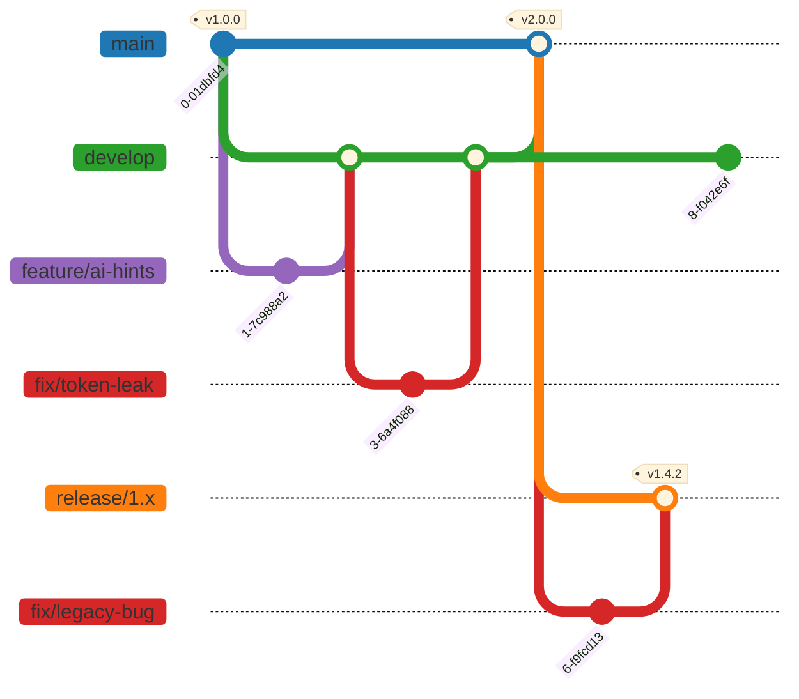

# Git Workflow: Simplified GitFlow

We use a streamlined `GitFlow` with long-lived integration branches plus per-major maintenance branches, so a fix can be shipped for the current major and one or more older, still-supported majors at the same time.

## Branches

| Branch        | Purpose                                                                                   | Protection (GitHub) |
|---------------|--------------------------------------------------------------------------------------------|----------------------|
| `main`        | **Production**: latest major, stable, versioned, published to NPM (`latest` dist-tag).     | ✅ Protected         |
| `develop`     | **Integration**: validated features for the next release of the current major.             | ✅ Protected         |
| `release/N.x` | **Maintenance**: long-lived branch per older major still supported (e.g. `release/1.x`); receives only backported fixes. | ✅ Protected |
| `feature/*`   | **Development**: new features (e.g. `feature/ai-hints`), branched from and merged into `develop`. | ❌ Free       |
| `fix/*`       | **Fixes**: bug fixes, branched from `develop` (current major) or a `release/N.x` (older major), merged back into the same branch it came from. | ❌ Free |

## Support policy

- **One active maintenance branch at a time.** Only the major immediately before the current one gets a `release/N.x` (e.g. while `main` is on `2.x`, `release/1.x` is maintained; once `3.0.0` ships, `release/1.x` is retired and `release/2.x` is cut). We don't keep an unbounded stack of old majors alive.
- **Fix-only, with a rare exception.** `release/N.x` only takes `fix/*` (PATCH bumps). A `feature/*` there is an explicit, justified exception rather than routine — same PR mechanics as `fix/*`, just called out as unusual and bumping MINOR instead of PATCH.

## Diagram

Note: `release/1.x` is actually cut from the last pre-bump commit on `main` (i.e. before `develop` is merged in for the `v2.0.0` bump), so it preserves the outgoing major's state. This is simplified in the diagram above for readability.

## Use cases

1. **Add a new feature.** Branch `feature/*` off `develop`. PR back into `develop`.
2. **Fix a bug in the current/in-development major.** Branch `fix/*` off `develop`. PR back into `develop`.
3. **Cut a new major release.** Branch `release/N.x` off `main` at the last pre-bump commit (`N` = outgoing major), then merge `develop` into `main` and tag the new major.
4. **Fix a bug in an older, still-supported major.** Branch `fix/*` off the relevant `release/N.x`. PR back into that same branch only. Tag `vN.Y.Z` and publish under its dedicated npm dist-tag (e.g. `npm publish --tag v1-lts`) so plain `npm install` still resolves to `latest`.
5. **Backport a fix to both lines.** Fix the current major on `develop` via its own `fix/*`. Separately reapply/cherry-pick the change into the relevant `release/N.x` via its own `fix/*`. There is no automatic forward/back merging between `release/N.x` and `develop`/`main`.

## Versioning: Semantic Versioning (SemVer)

We follow `MAJOR.MINOR.PATCH`:

- **MAJOR**: Breaking changes.
- **MINOR**: Backward-compatible feature additions.
- **PATCH**: Backward-compatible bug fixes.
