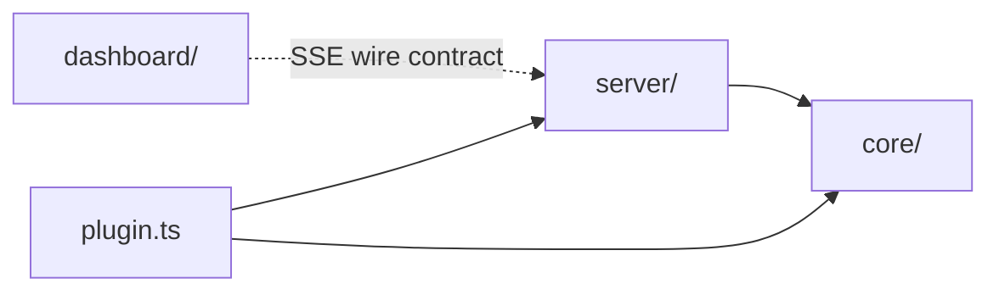

# Architecture Spine — opencode-session-viewer

## Design Paradigm

**Event-Sourced Projection + Reactive Push.** opencode's own `/event` stream is the single source of truth; the plugin's backend projects it into an in-memory read model (never persisted, never independently computed), and pushes that read model to the browser over SSE; the browser is a pure reactive renderer of whatever it receives.

```
opencode /event stream
        │  (Hooks.event)
        ▼
  core/  — Projector (state-store.ts, view-model.ts)
        │  (derived per-session view model)
        ▼
  server/ — SSE broadcast (sse.ts) + static asset serving (http.ts)
        │  (EventSource, over HTTP, localhost)
        ▼
  dashboard/ — Preact + signals view (pure render, main.tsx/store.ts/components/)
```

`core/` = the paradigm's Projector. `server/` = the transport. `dashboard/` = the view. No layer computes what the layer before it already computed.

## Invariants & Rules

### AD-1 — Live-update transport is SSE, not WebSocket or polling

- **Binds:** FR-3
- **Prevents:** mixed WS/SSE reconnect logic, and unwarranted bidirectional-channel complexity for a one-way feed
- **Rule:** All server→browser live updates flow over one SSE endpoint (`server/sse.ts`, native `EventSource` on the client). No WebSocket. No client-side polling interval anywhere in the dashboard.

### AD-2 — Backend is the sole owner of session/cost state, scoped to the current run

- **Binds:** FR-2, FR-3, FR-4
- **Prevents:** cost/status drift or duplicated computation between backend and frontend; historical (prior-invocation) sessions leaking into the dashboard
- **Rule:** `core/state-store.ts` starts **empty** at plugin-factory startup and is populated exclusively by `Hooks.event` handlers (`session.created/updated/idle/status/error`, `message.updated`) for the lifetime of this opencode process — it is never seeded from `client.session.list()`'s full project history, which can include sessions from prior opencode invocations (FR-2 Out of Scope). `client.session.list()` / `session.messages()` (SDK Sessions API) are used only to backfill fields for a session *already known* to the store. No module other than `core/state-store.ts` computes or independently caches per-session derived state; `dashboard/` may perform trivial display-only aggregation (e.g. summing already-authoritative per-session costs for the running total, FR-4) over data the backend already sent, but never derives a *new* fact opencode hasn't already reported.

### AD-3 — Wire format is a derived view model, never raw opencode events

- **Binds:** FR-2, FR-3, FR-4
- **Prevents:** the frontend re-deriving status/cost from raw `Event`/`Session`/`Message` objects (which would violate AD-2), and coupling the wire format to opencode SDK type churn
- **Rule:** `server/sse.ts` broadcasts only the backend's own per-session view model — `{ id, title, status, tokens, cost, messageCount, lastActivity, errorFlag, errorMessage? }` — never a raw opencode `Event`, `Session`, or `Message` object. Connection framing (initial snapshot vs. delta semantics) is fixed by AD-7.

### AD-4 — Dependency direction: core has no outgoing dependency on server or dashboard

- **Binds:** all
- **Prevents:** state/cost logic entangled with HTTP handlers or UI rendering, which blocks unit-testing the projector in isolation
- **Rule:** `core/` imports nothing from `server/` or `dashboard/`. `server/` and `dashboard/` each depend on `core/`'s types/output; `dashboard/` never imports `server/` internals — it only consumes the SSE wire contract (AD-3).



### AD-5 — Plugin configuration is read from the factory's `options` argument

- **Binds:** FR-5
- **Prevents:** relying on a generic `opencode.json` passthrough namespace that doesn't exist (the `Config` JSON schema is `additionalProperties: false` at the top level), or on `client.config.get()`, which wouldn't carry an unknown custom key either
- **Rule:** `port`, `autoLaunch`, and bind `hostname` are read once, synchronously, in `plugin.ts` from the plugin factory's second argument (`options: PluginOptions`), which opencode populates from the `[name, options]` tuple form of `opencode.json`'s `plugin` array (e.g. `"plugin": [["opencode-session-viewer", { "port": 4097 }]]`) — verified against `@opencode-ai/plugin`'s `packages/plugin/src/index.ts` (dev branch): `export type Plugin = (input: PluginInput, options?: PluginOptions) => Promise<Hooks>`. Defaults: `hostname` `127.0.0.1`, `autoLaunch` `true`.

### AD-6 — SSE broadcasts identically to every connected client; no per-client auth or filtering

- **Binds:** FR-3
- **Prevents:** divergent per-tab state, and effort spent building auth/session-filtering for a single-user localhost tool
- **Rule:** `server/sse.ts` broadcasts the same state to every currently-connected client. No per-client filtering, no auth layer. Revisit only if bind address ever defaults away from localhost (PRD §8 — currently out of scope).

### AD-7 — SSE connection protocol: snapshot-first, full-replace deltas, client-owned reconnect

- **Binds:** FR-3
- **Prevents:** a blank dashboard on load (no initial snapshot), silent field loss from a partial-diff merge disagreeing with a full-replace sender, and duplicated or unowned reconnect logic
- **Rule:** Every new SSE connection's **first message is a full snapshot** — the entire current view-model array. Every subsequent message is a per-session delta that is **always a full replacement** of that session's view model (never a partial-field patch); `dashboard/store.ts` always overwrites by `id`, never merges. Reconnection and backoff are handled entirely by the browser-native `EventSource`'s built-in auto-retry, plus `dashboard/store.ts` toggling the "disconnected" indicator (FR-3) on `onerror`/`onopen`; `server/sse.ts` takes no special reconnect action beyond accepting new connections statelessly and immediately sending them a fresh snapshot.

## Consistency Conventions

| Concern | Convention |
| --- | --- |
| Naming (entities, files, interfaces, events) | Per-session view-model fields: `id, title, status, tokens, cost, messageCount, lastActivity, errorFlag, errorMessage?` (camelCase). `id` is opencode's own session ID string, verbatim — never regenerated or aliased. |
| Data & formats (ids, dates, error shapes, envelopes) | `status` ∈ `"idle" \| "busy" \| "retry"` (never `"error"` — errors are `errorFlag`/`errorMessage`, per PRD glossary). `tokens: number` and `cost: number` (dollars) are sibling top-level view-model fields, each a sum of opencode's own reported per-assistant-message `tokens`/`cost` for that session — never independently computed. `lastActivity` = ISO 8601 UTC string. SSE envelope: first `data:` line on any connection is the full view-model array (AD-7 snapshot); every subsequent `data:` line is a single full-replacement session view model (AD-7 delta). |
| State & cross-cutting (mutation, errors, logging, config, auth) | Config read once at plugin-factory invocation (AD-5); never re-read mid-run. Logging via `client.app.log()` only — never `console.log` (opencode plugin convention). Local HTTP server bind failures are caught, logged via `client.app.log()`, and never throw out of the plugin factory (FR-1 consequence: opencode startup is never blocked). `Hooks.dispose()` closes the `Bun.serve` server and all open SSE connections. |
| Security (untrusted content) | Session titles (and any session-authored text ever rendered) are untrusted input (PRD §8): `dashboard/` renders them only through Preact/htm's default text interpolation, which auto-escapes — no `dangerouslySetInnerHTML`, no raw-HTML injection from session data, anywhere in `dashboard/`. |

## Stack

| Name | Version |
| --- | --- |
| Bun (runtime, per opencode's plugin runtime requirement) | matches opencode's own Bun requirement — not independently pinned |
| TypeScript | per Bun's bundled toolchain |
| @opencode-ai/plugin (peer) | minimum compatible version declared per PRD §9 versioning policy |
| preact | 10.29.8 |
| @preact/signals | 2.11.1 |
| htm | 3.1.1 |
| Bun.build | native to the Bun runtime — no separate bundler dependency |

## Structural Seed

```text
opencode-session-viewer/
  src/
    plugin.ts              # factory: (input, options) -> Hooks; wires everything below; owns dispose()
    core/
      state-store.ts        # the Projector: in-memory Map<sessionID, ViewModel>, pure update fns (AD-2, AD-4)
      view-model.ts          # ViewModel shape + derivation from Session/Message data
    server/
      http.ts                # Bun.serve setup, static dashboard asset serving, FR-5 config application
      sse.ts                  # SSE endpoint; broadcasts view-model snapshots/deltas (AD-1, AD-3, AD-6)
    dashboard/
      main.tsx                # Preact entry, mounts the session table
      components/              # session row, aggregate total, disconnected indicator
      store.ts                  # client-side signals, hydrated from the SSE stream (AD-2: no derivation here)
  dist/                        # Bun.build output (gitignored)
  package.json
```

## Capability → Architecture Map

| Capability / Area | Lives in | Governed by |
| --- | --- | --- |
| FR-1 Auto-launch | `plugin.ts`, `server/http.ts` | AD-5 (config), Consistency (startup-failure non-fatal) |
| FR-2 List all sessions | `core/state-store.ts`, `core/view-model.ts` | AD-2, AD-3 |
| FR-3 Live updates via event stream | `server/sse.ts`, `dashboard/store.ts` | AD-1, AD-3, AD-6 |
| FR-4 Per-session and aggregate cost | `core/view-model.ts`, `dashboard/components/` | AD-2, AD-3 (cost never independently computed) |
| FR-5 Basic configuration | `plugin.ts` | AD-5 |

## Deferred

- **Historical/persisted session storage** — PRD explicitly scopes to the current opencode run only (§4.2 Out of Scope); no persistence layer is decided here.
- **Non-localhost bind-address opt-in mechanics** — PRD §8 flags this as needing an auth story before it's ever defaulted on; AD-6's no-auth stance holds only for the localhost default.
- **Per-model cost breakdowns, cost trend charts, budget alerts** (PRD §5.2) — when built, they extend `core/view-model.ts` and `dashboard/components/`; no paradigm change anticipated, but not designed here.
- **Manual dashboard re-open path** (PRD Open Question 1) — a future command/keybind; no server-side design implication is fixed yet.
- **Testing tool/framework choice** — not fixed at this altitude; `core/`'s zero-dependency isolation (AD-4) is what makes any choice cheap later.
- **Epic/story breakdown** — this spine is initiative-altitude; `bmad-create-epics-and-stories` owns splitting FR-1..FR-5 into buildable stories.
- **AD-5's config path is source-verified, not example-verified** — confirmed against `@opencode-ai/plugin`'s TS source (the `Plugin`/`PluginOptions` types), but no worked example on `opencode.ai/docs` shows the `[name, options]` tuple form driving a plugin's second argument end-to-end. Smoke-test this against a real opencode instance early in implementation before other FR-5 work depends on it.
